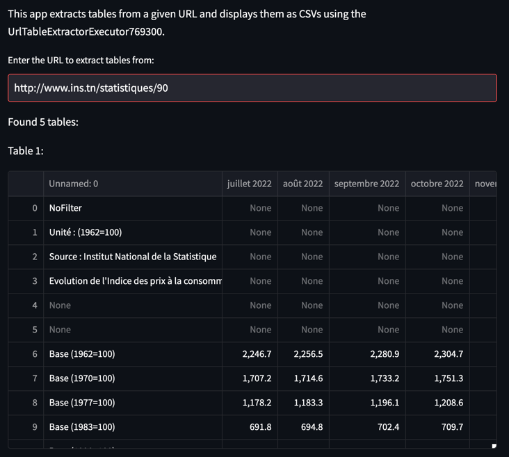

# GPT Deploy: The Microservice Magician 🧙🚀
Turn your natural language descriptions into fully functional, deployed microservices with a single command!

<p align="center">
<a href="https://github.com/tiangolo/fastapi/actions?query=workflow%3ATest+event%3Apush+branch%3Amaster" target="_blank">
    
</a>
<a href="https://coverage-badge.samuelcolvin.workers.dev/redirect/tiangolo/fastapi" target="_blank">
    
</a>
<a href="https://pypi.org/project/fastapi" target="_blank">
    
</a>
<a href="https://pypi.org/project/fastapi" target="_blank">
    
</a>

This project streamlines the creation and deployment of microservices. 
Simply describe your task using natural language, and the system will automatically build and deploy your microservice. 
To ensure the executor accurately aligns with your intended task, you can also provide test scenarios.

# Quickstart
## install
```bash
pip install gptdeploy

```

## run
```bash
gptdeploy --description "Take a pdf file as input, and returns the text it contains." \
--test "https://www2.deloitte.com/content/dam/Deloitte/de/Documents/about-deloitte/Deloitte-Unternehmensgeschichte.pdf"
```


# Overview
The graphic below illustrates the process of creating a microservice and deploying it to the cloud.
```mermaid
graph TB
    AA[Task: Generate QR code from URL] --> B{think a}
    AB[Test: https://www.example.com] --> B{think a}
    B -->|Identify Strategie 1| C[Strategy 1]
    B -->|Identify Strategie 2| D[Strategy 2]
    B -->|Identify Strategie N| E[Strategy N]
    C --> F[executor.py, test_executor.py, requirements.txt, Dockerfile]
    D --> G[executor.py, test_executor.py, requirements.txt, Dockerfile]
    E --> H[executor.py, test_executor.py, requirements.txt, Dockerfile]
    F --> I{Build Image}
    G --> I
    H --> I
    I -->|Fail| J[Apply Fix and Retry]
    J --> I
    I -->|Success| K[Push Docker Image to Registry]
    K --> L[Deploy Microservice]
    L --> M[Create Streamlit Playground]
    M --> N[User Tests Microservice]
```
1. GPT Deploy identifies several strategies to implement your task.
2. It tests each strategy until it finds one that works.
3. For each strategy, it creates the following files:
- executor.py: This is the main implementation of the microservice.
- test_executor.py: These are test cases to ensure the microservice works as expected.
- requirements.txt: This file lists the packages needed by the microservice and its tests.
- Dockerfile: This file is used to run the microservice in a container and also runs the tests when building the image.
4. GPT Deploy attempts to build the image. If the build fails, it uses the error message to apply a fix and tries again to build the image.
5. Once it finds a successful strategy, it:
- Pushes the Docker image to the registry.
- Deploys the microservice.
- Creates a Streamlit playground where you can test the microservice.
6. If it fails 10 times in a row, it moves on to the next approach.

# Examples
## OCR
```bash
gptdeploy --description "Generate QR code from URL" --test "https://www.example.com"
```

## 3d model info
```bash
gptdeploy --description "Given a 3d object, return vertex count and face count" --test "https://raw.githubusercontent.com/polygonjs/polygonjs-assets/master/models/wolf.obj"
```

## Table extraction
```bash
--description "Given a URL, extract all tables as csv" --test "http://www.ins.tn/statistiques/90"
```


## Audio to mel spectrogram
```bash
gptdeploy --description "Create mel spectrograms from audio file" --test "https://cdn.pixabay.com/download/audio/2023/02/28/audio_550d815fa5.mp3"
```

# 🔮 vision
Use natural language interface to create, deploy and update your microservice infrastructure.

# TODO
critical
- [ ] add buttons to README.md
- [ ] fix problem with package installation
- [ ] add more interesting examples to README.md
- [ ] api key in install instruction
- [ ] add instruction about cleanup of deployments

Nice to have
- [ ] hide prompts in normal mode and show them in verbose mode
- [ ] tests
- [ ] clean up duplicate code
- [ ] support popular cloud providers
- [ ] support local docker builds
- [ ] autoscaling enabled for cost saving


[//]: # ([![Watch the video]&#40;https://i.imgur.com/vKb2F1B.png&#41;]&#40;https://user-images.githubusercontent.com/11627845/226220484-17810f7c-b184-4a03-9af2-3a977fbb014b.mov&#41;)
